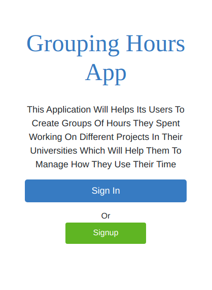
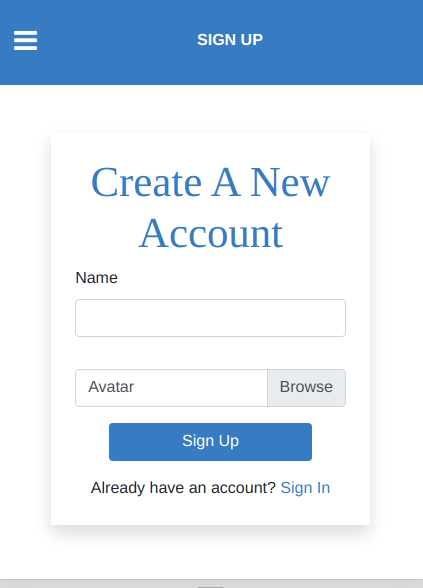
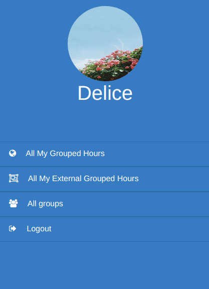

# Group Hours App

Group Hours is an Application that Will help those who use it to group hours spent on different projects in their universities.




This App has the following features:

- User can create account/Log in
- A user who is new will only visit landing, signup, signin pages
- Logged-in user will see its profile page
- Logged-in user will be able to view all groupings hours created
- Logged-in user will be able to create a new grouping
- Logged-in user will be able to view external grouping created
- Logged-in user will be able to create a new external grouping
- Logged-in user will be able to view all groups he/she created
- Logged-in user will be able to create a new group
- Logged-in user will be able to view information about any group
- Logged-in user will be able to logout

## Built With

- Ruby v2.7.2
- Ruby on Rails v6.1.1
- Rspec
- Bootstrap

## Live Demo

[Heroku-link](https://group-hours.herokuapp.com)

## Getting Started

### Prerequisites

To get this project up and running locally, you must already have ruby and necessary gems installed on your computer

To get this project set up on your local machine, follow these simple steps:

1. Open terminal
2. Clone the repository 
``` git@github.com:DeliceLydia/group_hours_app.git ```
3. Cd in the project ``` group_hours_app ```
4. Run ``` bundle install ```
5. Create database by running ``` rails db:create ```
6. Run database migration by running ``` rails db:migrate ```
7. Start your server ``` rails server ```
8. Run the app ``` http://localhost:3000/ ```

## Run tests

```
  rspec --format documentation
```
## Contributing

Contributions, issues, and feature requests are welcome!

Feel free to check the [issues page](https://github.com/DeliceLydia/group_hours_app/issues).

## Authors

👤 **Delice Lydia**
  - GitHub: [@githubhandle](https://github.com/DeliceLydia)
  - Twitter: [@twitterhandle](https://twitter.com/IngabireLydia)
  - LinkedIn: [LinkedIn](https://twitter.com/IngabireLydia3)

## Show your support

Give a ⭐️ if you like this project!

## Acknowledgments

Credits goes to the [**Gregoire Vella on Behance**](https://www.behance.net/gallery/19759151/Snapscan-iOs-design-and-branding) for the design

# License
​
This project is [MIT](./LICENSE.txt) licensed.
